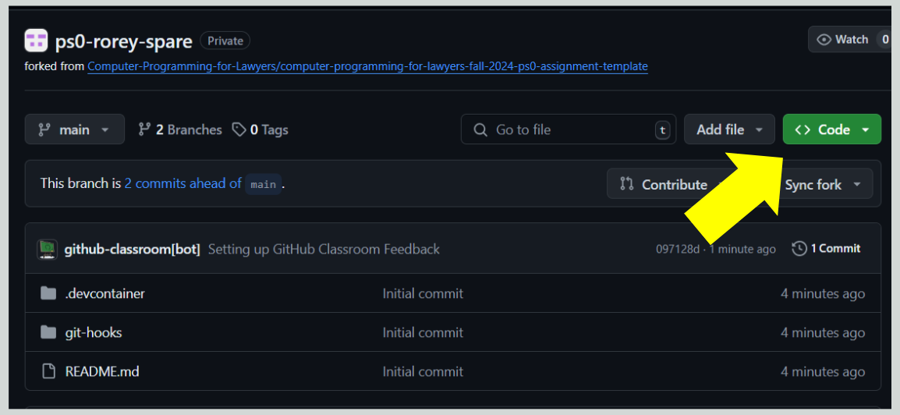
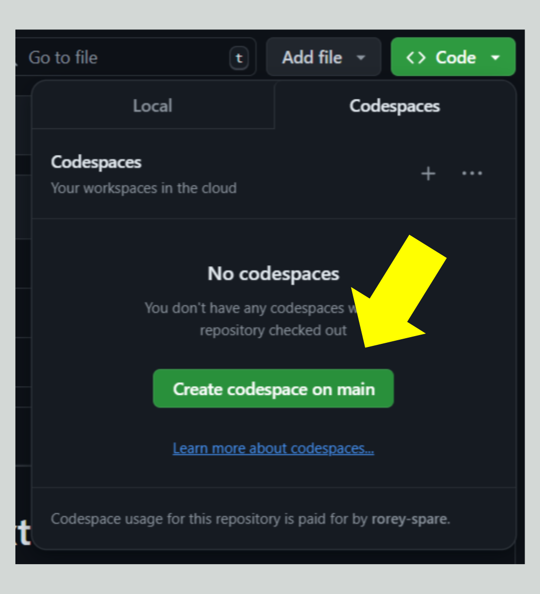

# Getting Started with Codespaces (Read Me First)

Welcome to Computer Programming for Lawyers!

This semester, all of our programming will take place on GitHub Codespaces. Codespaces is a cloud-based development environment that allows you to code directly from your browser. It provides everything you might need in your browser, without the need to set up anything on your local device.

The rest of this guide will walk you through how to set up and start using GitHub Codespaces for your first problem set.

## Pre-requisites

You should be reading this in what we call a **GitHub Repository.** Think of repositories as a folder where you can store your code, your files, and each file's revision history. 

When you accepted this first assignment, **GitHub Classroom** (the tool you'll use to complete all problem sets this semester) created a private repository just for your assignment. That's why you should see your GitHub username at the top of this page. If you don't see your username, make sure you've [created a GitHub account](https://github.com/join) and accepted [the assignment](https://classroom.github.com/a/pk-eUlmG). 

***And don't forget to sign up for [GitHub Education benefits](https://github.com/education). This is critical. Sign up using your class schedule (rather than your student ID), because GitHub requires the semester/academic year to be printed.***

GitHub allows you to create a Codespace, the programming interface we'll use this semester, for any repository. That means each problem set will follow the below steps:
1. We'll send you a link to the problem set assignment, which is housed in GitHub Classroom.
2. Once you accept the assignment, GitHub will create a personalized, private repository that includes assignment instructions.
3. You'll then create a Codespace in that private repository. You'll complete the assignment in the Codespace you've just created.
4. Once you complete the assignment in Codespaces, you'll save your changes (through a process called **Committing** and **Pushing** that we describe below) and then **Submit**. 

## Terms and Information to Know

### Committing and pushing
**Committing** and **pushing** are how you can add the changes you made in Codespaces to your GitHub repository. That way your instructor and/or teammates can see your latest work when you’re ready to share it. Think of it like saving a file, and then uploading it to where it needs to go. 

We've set up the first few problem sets to automatically commit and push any changes you make in Codespaces to your repository every 5 minutes. That not only helps us see how you've gone about solving the problem, but it gives you time to develop a habit for commmiting & pushing when that might now feel unfamiliar.

Typically, you make a commit when you have made changes to your project that you want to “checkpoint.” You can also add a helpful **commit message** to remind yourself or your teammates what work you did (e.g. “Added a README with information about our project”).

Once you have a commit or multiple commits that you’re ready to add to your repository, you can use the push command to add those changes to your remote repository. Committing and pushing may feel new at first, but we promise you’ll get used to it. We'll show you how to commit and push in Codespaces a little later on.

### Repositories 
We mentioned repositories already, they are where your project work happens, but let’s talk a bit more about the details of them! As you work more on GitHub you will have many repositories which may feel confusing at first. Fortunately, your ["GitHub dashboard"](https://docs.github.com/en/github/setting-up-and-managing-your-github-user-account/about-your-personal-dashboard) helps to easily navigate to your repositories and see useful information about them. Make sure you’re logged in to see it!

Repositories also contain **README**s. You can add a README file to your repository to tell other people about your project. We are using this README to communicate how to learn GitHub with you, and we'll include problem set instructions there throughout the course.

## Let's go! How to Create a Codespace and Complete Problem Set 1
Okay, now it's time to create a Codespace. Like we said earlier, right now you should be reading this in the ps1 repository (that means near the top of your screen you should see ps1-*your username*). *If you see something else, go back to the pre-requisites section at the top.*

How to create a Codespace:
1. Click the green "Code" button pictured here:

2. In the menu that opens, select "Create codespace on main": 

3. That should open a new tab. It will take a few minutes to load.
4. Once your codespace opens, you'll see instructions for next steps on the screen. Don't worry, you can still access these instructions again later.
